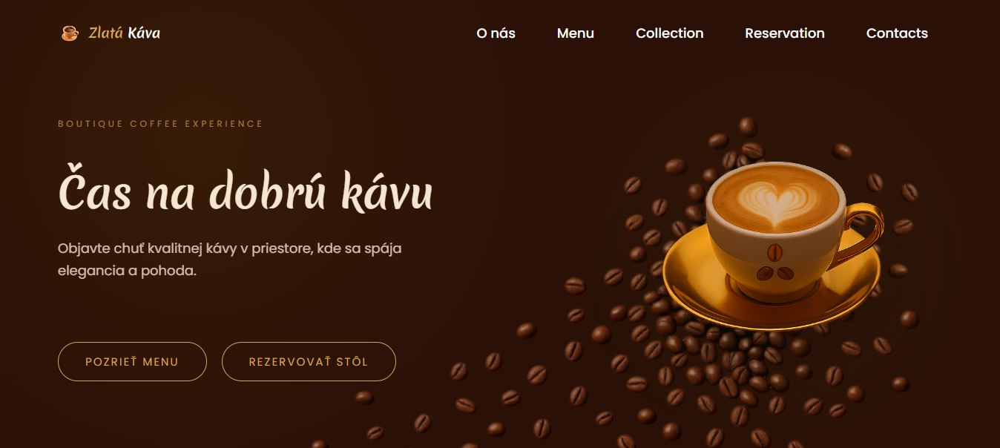
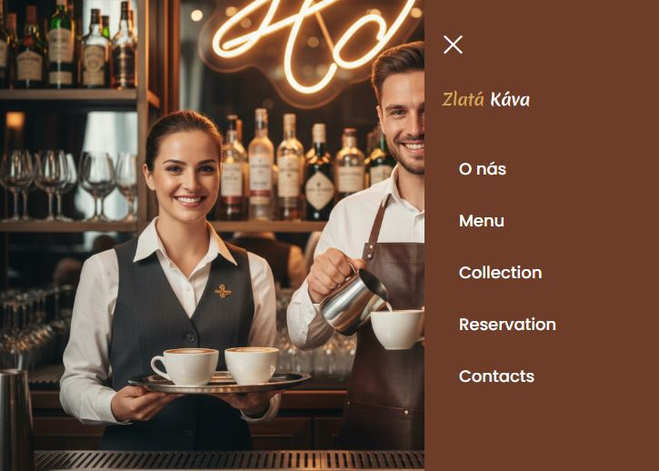
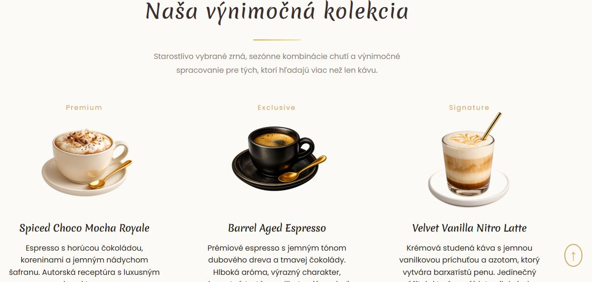
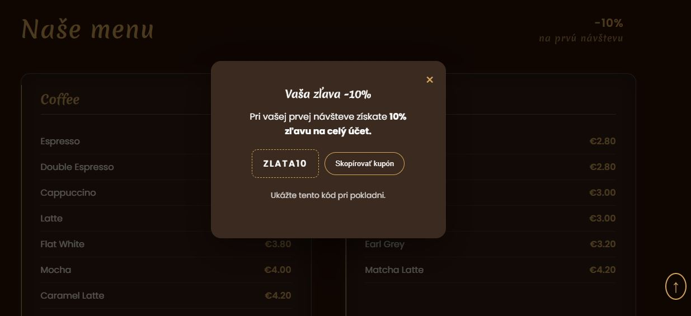

# ☕ Zlatá Káva — Modern Coffee Shop Landing Page

An elegant, warm, and fully responsive website template designed for local coffee shops, bakeries, and cafes. Built with clean code and available in **English** and **Slovak**, this landing page offers a cozy UI, interactive modals, and a commercial-ready structure that is easy to customize.

---

##  Key Features

- **Multilingual Support:** Pre-configured in English and Slovak, making it easy to adapt for European or global clients.
- **Fully Responsive Design:** Seamlessly optimized for mobile, tablet, and desktop screens.
- **Interactive Modals:** Built-in modal windows for table reservations, coffee ordering, and promotional discounts.
- **Dynamic UX Elements:** Custom guest selector, phone number pre-fill, and interactive copy-to-clipboard coupon functionality.
- **Cozy & Premium UI:** Warm color palette, custom typography, and smooth CSS transitions.
- **High Performance:** Lightweight code without heavy framework dependencies for ultra-fast loading speed.

---

##  Tech Stack

- **HTML5** — Semantic markup and accessible structure
- **CSS3** — Custom styling, Flexbox, Grid, CSS Variables, and Animations
- **JavaScript (ES6+)** — Clean DOM manipulation and modal state handling
- **GitHub Pages** — Hosting & deployment

---

##  What's Included

- Complete, well-structured source code (`index.html`, `style.css`, `script.js`)
- Dual-language setup (English & Slovak)
- Fully functional contact form UI with validation feedback
- Optimized asset folder structure with image showcase

---

##  Live Demo

-  **Live Website:** [https://liviiasolo.github.io/zlata-kava/](https://liviiasolo.github.io/zlata-kava/)

---

##  Screenshots

### Homepage

### Mobile Navigation

### Menu & Coffee Collection

### Special Offers & Discount Modal

---

##  Licensing & Commercial Use

This template is available for purchase and full customization. 

- **Customization:** Easily adaptable to any brand identity, color scheme, or target language.
- **License:** [MIT License](./LICENSE) — permits commercial use, modification, and distribution.

---

##  Author & Contact

**Liviia Solo**  
*Frontend Developer*

-  **Portfolio:** [liviiasolo.github.io/Portfolio/](https://liviiasolo.github.io/Portfolio/)
